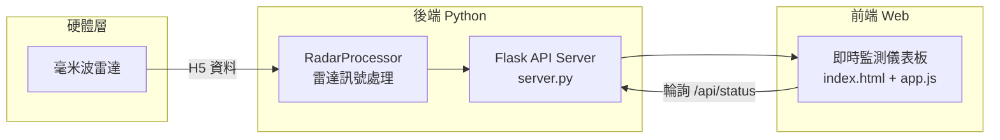

# VisionWave Guardian

**基於毫米波雷達的智慧視力與健康監測系統**

> 國立成功大學 成大一定隊

---

## 📋 專案簡介

VisionWave Guardian 使用毫米波雷達（mmWave Radar）技術，以非接觸方式即時監測使用者的**視距安全**與**久坐狀態**，藉由多層警示機制（聲音、瀏覽器通知、視覺化警告）守護使用者的視力與健康。

### 核心功能

| 功能 | 說明 |
|------|------|
| 🔬 視距監測 | 即時偵測使用者是否距離螢幕小於 40 公分，自動發出警示 |
| 💺 久坐監測 | 追蹤連續坐姿時間，超過 30 分鐘則提醒起身活動 |
| 🔔 多重警示 | 頁面內通知、作業系統桌面通知、音效提醒三管齊下 |
| 📊 數據分析 | 即時趨勢圖表、安全距離比例、警示歷史記錄 |

---

## 🏗️ 系統架構



**資料流程：**
1. 毫米波雷達產生 H5 格式的原始 RDI 資料
2. `RadarProcessor` 載入背景、校準閾值，逐幀分析距離與坐姿
3. Flask Server 將分析結果以 JSON API 提供
4. 前端每秒輪詢 API，更新儀表板、觸發警示

---

## 📁 專案結構

```
visionware-guardian/
├── visionware/
│   ├── RadarTracker_module.py     # 核心雷達訊號處理模組
│   ├── frontend-ui/
│   │   ├── server.py              # Flask API 伺服器（前後端橋接）
│   │   ├── index.html             # 前端主頁面
│   │   ├── app.js                 # 前端應用程式邏輯
│   │   ├── style.css              # UI 設計系統
│   │   ├── start_server.sh        # 一鍵啟動腳本
│   │   └── README.md              # 前端說明文件
│   ├── test/                      # 測試腳本與分析工具
│   │   ├── Streaming.py           # H5 串流處理範例
│   │   ├── model_test.py          # 模型測試
│   │   └── ...
│   └── dataset/                   # 測試資料集（40cm, 60cm, 無人等情境）
└── README.md                      # 本文件
```

---

## 🚀 快速啟動

### 環境需求

- Python 3.9+
- pip 套件管理器
- 現代瀏覽器（Chrome 90+ / Firefox 88+ / Safari 14+ / Edge 90+）

### 1. 安裝依賴

```bash
cd visionware/frontend-ui
pip install flask flask-cors
```

若需使用雷達後端功能，另需安裝：

```bash
pip install numpy h5py
```

### 2. 啟動伺服器

**方式一：一鍵啟動**

```bash
cd visionware/frontend-ui
bash start_server.sh
```

**方式二：手動啟動**

```bash
cd visionware/frontend-ui
python3 server.py
```

啟動後開啟瀏覽器訪問 **http://localhost:8000**

### 3. 連接雷達後端（選配）

設定環境變數以啟用真實雷達資料處理：

```bash
export RADAR_BG_PATH=/path/to/nopeople_background.h5
export RADAR_CAL_PATH=/path/to/nopeople_folder/
python3 server.py
```

---

## 📡 API 規格

### `GET /api/status`

取得目前的感測狀態。

**回應範例：**
```json
{
    "distance_safe": true,
    "sitting": false
}
```

| 欄位 | 型別 | 說明 |
|------|------|------|
| `distance_safe` | `boolean` | `true` = 距離安全（≥ 40cm），`false` = 距離過近 |
| `sitting` | `boolean` | `true` = 偵測到有人坐著，`false` = 未偵測到 |

### `POST /api/status`

手動更新狀態（供外部程式整合使用）。

**請求 Body：**
```json
{
    "distance_safe": false,
    "sitting": true
}
```

### `POST /api/upload`

上傳 H5 檔案進行雷達資料處理（需先初始化 RadarProcessor）。

**請求格式：** `multipart/form-data`，欄位名稱 `file`

**回應範例：**
```json
{
    "frames_processed": 1024,
    "current_state": { "distance_safe": true, "sitting": false },
    "statistics": { ... }
}
```

### `GET /api/info`

取得系統資訊。

```json
{
    "system": "VisionWave Guardian",
    "version": "1.0.0",
    "radar_available": true,
    "radar_initialized": true
}
```

---

## ⚙️ 系統設定

前端的警示參數可在 `app.js` 中的 `CONFIG` 物件調整：

| 參數 | 預設值 | 說明 |
|------|--------|------|
| `POLLING_INTERVAL` | 1000 ms | API 輪詢間隔 |
| `DISTANCE_UNSAFE_TRIGGER` | 0 ms | 距離不安全多久後觸發警示 |
| `DISTANCE_ALERT_REPEAT` | 15 s | 距離警示重複間隔 |
| `SITTING_TRIGGER` | 30 min | 久坐多久後觸發警示 |
| `SITTING_ALERT_REPEAT` | 10 min | 久坐警示重複間隔 |
| `SOUND_ENABLED` | `true` | 是否啟用音效提醒 |

---

## 🛠️ 技術堆疊

### 後端
- **Python 3** — 核心處理語言
- **Flask** — 輕量 Web 框架
- **NumPy / h5py** — 科學運算與 HDF5 資料讀取
- **RadarProcessor** — 自研雷達訊號處理引擎

### 前端
- **HTML5** — 語意化標記
- **CSS3** — Glassmorphism 玻璃擬態設計、Flexbox / Grid 佈局
- **JavaScript (ES6+)** — 非同步 API、狀態管理、Web Audio API
- **Chart.js 4.4** — 即時資料視覺化

---

## 👥 開發團隊

**國立成功大學 成大一定隊**

劉冠宏 · 蕭品睿 · 李奕潔 · 李芷昀 · 鍾馥謙 · 卓芷妍 · 楊傑凱

**指導教授：** 王維聰 博士

---

## 📄 授權

© 2025 VisionWave Guardian — 國立成功大學 成大一定隊. All rights reserved.
